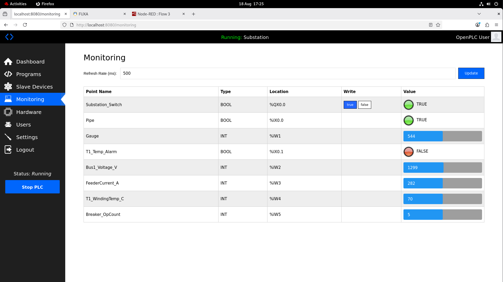
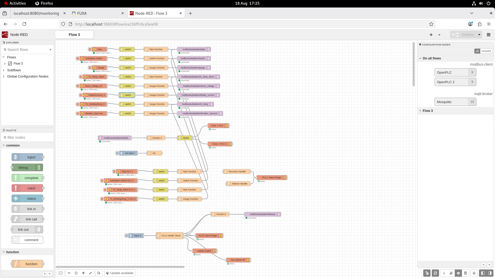
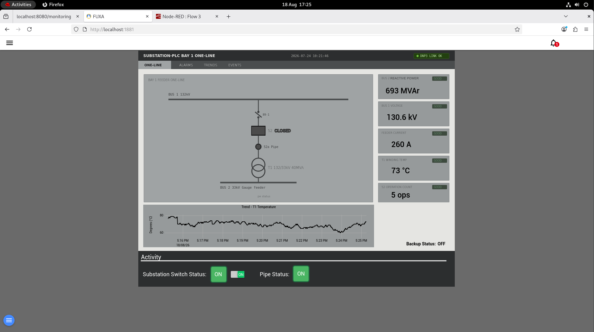
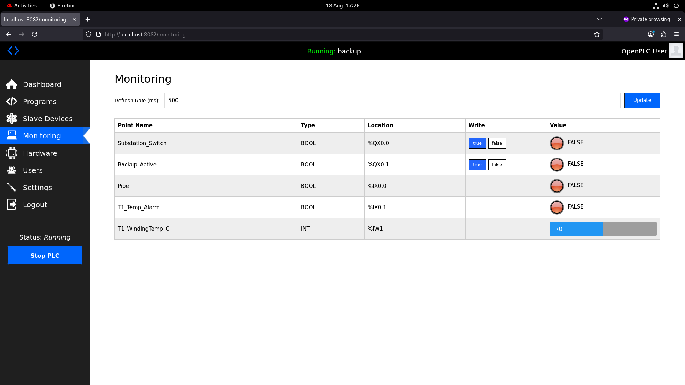
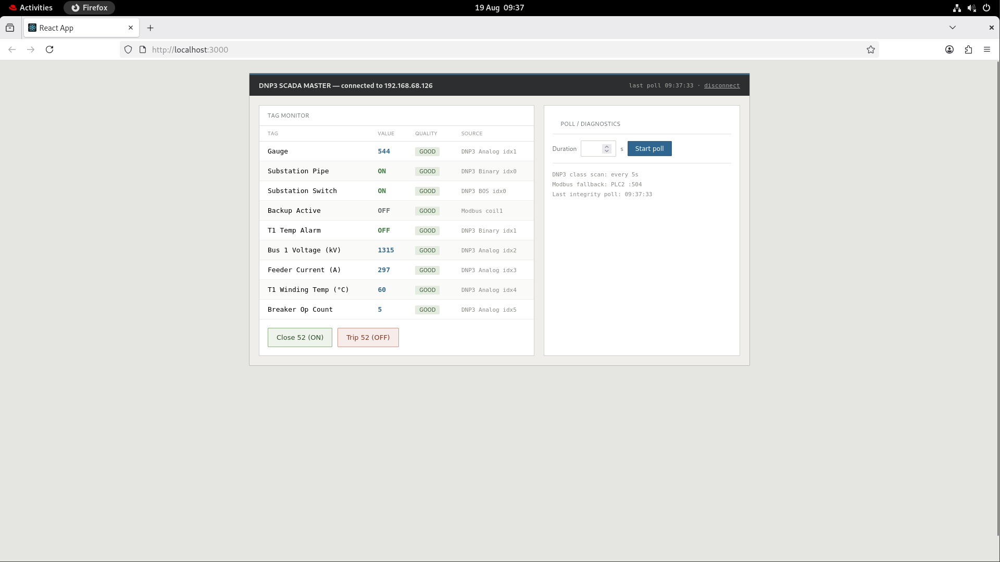

# Substation Simulation — ICS/OT Security Lab


A self-contained Industrial Control System (ICS) simulation of an electrical
substation, built for security research and demonstration. It models a real
OT environment — a PLC driving a substation process, a SCADA master polling it
over DNP3, an MQTT telemetry pipeline, and an operator HMI — and ships with
attack tooling and hardening measures that demonstrate the security weaknesses
of unauthenticated industrial protocols (Modbus, DNP3).
The lab runs across two machines (VMs): **VM1** hosts the PLC and HMI layer,
**VM2** hosts the SCADA master and web frontend. Each is brought up with a
single Docker Compose command.

---
## Virtual Machine Setup

### Note
If at any point you run into the error "is not valid yet" after saving the machine state and reloading it later just run these commands to reset the machine's time
```bash
sudo systemctl restart chronyd
sudo chronyc makestep
```

### Overview
This section covers deploying the substation simulation across two Red Hat
Enterprise Linux (RHEL) virtual machines running in VirtualBox. VM 1 hosts the
PLC and HMI stack, VM 2 hosts the SCADA master and web frontend.

### Prerequisites
Software required on the host machine:
- VirtualBox — https://www.virtualbox.org/wiki/Downloads
- RHEL 9 Boot ISO — https://developers.redhat.com/products/rhel/download

Accounts required:
- Red Hat Developer Account — https://developers.redhat.com (free, no license needed)

### Creating a Red Hat Developer Account
1. Go to https://developers.redhat.com and click Register
2. Fill in your details and verify your email
3. This gives free access to RHEL with a no-cost developer subscription

### Downloading the RHEL ISO
1. Log into your developer account at https://developers.redhat.com/products/rhel/download
2. Select Red Hat Enterprise Linux 9.6 (x86_64)
3. Download the Boot ISO (~800MB)

### Creating VM 1 — PLC/HMI
In VirtualBox click New and configure:
- Name: Substation-PLC
- ISO Image: Select the RHEL Boot ISO
- Username and Password: Whatever you want
- RAM: 4096MB
- CPU: 2 cores
- Disk: 20GB dynamically allocated
- Storage: Mount the RHEL Boot ISO

Open Settings > Network and set Attached to to Bridged Adapter.

### Installing RHEL on VM 1
1. Start the VM — it boots from the ISO into the RHEL installer
2. Select English and click Continue
3. At Installation Destination — click the virtual disk, leave Automatic selected, click Done (you might have to do this twice)
4. At Connect to Red Hat — enter your developer account credentials to activate the subscription
5. At Software Selection — select Server with GUI, click Done
6. At Network & Hostname — enable the network adapter, confirm it gets an IP
7. At Root Password — set a root password
8. At User Creation — create a user (e.g. your-name), tick Make this user administrator
9. Click Begin Installation and wait for it to complete
10. Click Reboot System when done
11. Complete initial setup

### Installing Docker on VM 1
Open a terminal and run:
```bash
sudo dnf install -y dnf-plugins-core
sudo dnf config-manager --add-repo https://download.docker.com/linux/rhel/docker-ce.repo
sudo dnf install -y docker-ce docker-ce-cli containerd.io docker-compose-plugin
sudo systemctl start docker
sudo systemctl enable docker
sudo usermod -aG docker $USER
```
Log out and back in, then verify:
```bash
docker --version
docker compose version
```
Install Git and the repository on the VM
```bash
sudo dnf install git
git clone https://github.com/puck-ux/Substation-Simulation.git
```
Power down the VM

### Creating VM 2 — DNP3 SCADA Master
1. Right click VM 1 and click "clone"
2. Rename it something like Substation-DNP3
3. Choose "Generate new MAC addresses for all network adapters" under MAC Address Policy
4. Click finish

---
## Quick Start
### VM1 — PLC / HMI
```bash
cd Substation-Simulation/vm1
docker compose pull
docker compose up -d
```
### Finding VM1's IP Address
VM2 needs VM1's IP address to connect to the PLC. On **VM1**, open a terminal and run:
```bash
ip addr show enp0s3
```
Look for the `inet` line — the address (e.g. `192.168.68.110`) is VM1's IP. With
a bridged adapter this is assigned by DHCP and can change when you reconnect or
switch networks; if VM2 stops connecting, re-check it here and update VM2's `.env`.

### VM2 — SCADA Master
```bash
# VM1 must already be running and reachable on the network.
sudo dnf install -y nodejs npm
cd Substation-Simulation/vm2
# Set VM1's IP
cp .env.example .env
nano .env                        # OPENPLC_IP=<VM1's IP>
# exit it with ctrl + x then y
# Backend (builds from source — first run takes a few minutes)
docker compose up -d --build
# Frontend (separate dev server on :3000)
cd dnp3web/dnp3frontend
npm install
npm start
```
VM2 needs to know VM1's address. Set `OPENPLC_IP` in the `.env` file to
whatever IP VM1 has on your network, then bring it up.

---
## Access Points
Once VM1 is running, the backup MUST be opened in an incognito tab and make sure to click start plc on both OpenPLCs:
| Interface        | URL                        | Login             |
|------------------|----------------------------|-------------------|
| OpenPLC (primary)| http://localhost:8080      | openplc / openplc |
| OpenPLC (backup) | http://localhost:8082      | openplc / openplc | 
| Node-RED         | http://localhost:1880      | —                 |
| FUXA HMI         | http://localhost:1881      | —                 |
Once VM2 is running:
| Interface        | URL                        |
|------------------|----------------------------|
| DNP3 web frontend| http://localhost:3000      |
| Tag API (JSON)   | http://localhost:3001/tags |
### PLC


### NodeRed


### HMI


### Backup PLC


### DNP3 Master

---
## Architecture
```
  VM1 — Substation-PLC                        VM2 — Substation-DNP3
 ┌──────────────────────────┐                ┌────────────────────────┐
 │  OpenPLC (outstation)    │◄───DNP3 :20000─┤  dnp3master (SCADA)    │
 │  OpenPLC backup          │◄───Modbus :502─┤                        │
 │  Node-RED (Modbus→MQTT)  │                │  dnp3web (frontend)    │
 │  Mosquitto (MQTT broker) │                └────────────────────────┘
 │  FUXA (HMI)              │                      │
 └──────────────────────────┘                      │
        bridged LAN ───────────────────────────────┘
```
- **OpenPLC** runs the substation control logic as a DNP3 outstation and Modbus
  server. A backup PLC provides failover.
- **Node-RED** bridges Modbus data to MQTT.
- **Mosquitto** is the MQTT broker feeding the HMI.
- **FUXA** is the operator HMI dashboard.
- **dnp3master** (VM2) polls the PLC over DNP3 and exposes the tags via a web
  frontend and JSON API.
### Process points
| Tag                | Type            | Address         |
|--------------------|-----------------|-----------------|
| Substation Switch  | Coil (BOS)      | %QX0.0 / coil 0 |
| Substation Pipe    | Binary input    | %IX0.0          |
| Gauge              | Analog input    | %IW1            |
| Bus1 Voltage       | Analog input    | idx 2           |
| Feeder Current     | Analog input    | idx 3           |
| T1 Winding Temp    | Analog input    | idx 4           |
| Breaker Op Count   | Analog input    | idx 5           |
| T1 Temp Alarm      | Binary input    | idx 1           |

---
# Attacks
For this we will create a third VM with Debian

## Attacker VM Setup (VM3 — Debian)

The attack scripts run from a third VM on the same network segment as VM1 and
VM2. This VM uses Debian and runs command-line only (no desktop).

### Creating VM 3 — Attacker

In VirtualBox click **New** and configure:

- **Name:** Attacker
- **ISO Image:** Debian 12 netinst ISO — [Download Here](https://cdimage.debian.org/cdimage/archive/12.12.0/amd64/iso-cd/debian-12.12.0-amd64-netinst.iso)
- Leave "Proceed with Unattended Installation" unchecked or you will download the desktop version!
- **RAM:** 2048MB
- **CPU:** 2 cores
- **Disk:** 20GB dynamically allocated
- **Network:** Bridged Adapter (must be on the same network as VM1 and VM2)

### Installing Debian

The Debian installer has more steps than RHEL. Work through the screens in order:

1. At the boot menu, select **Graphical Install**.
2. **Language / Location / Keyboard** — select your language, country, and keyboard layout.
3. **Network configuration:**
   - It auto-configures via DHCP over the bridged adapter.
   - **Hostname:** enter a name (e.g. `attacker`).
   - **Domain name:** leave blank and continue.
4. **Set up users and passwords:**
   - **Root password:** set a root password (the attacks run as root).
   - **Full name / username / password:** create your user account.
5. **Clock / Timezone** — select your timezone.
6. **Partition disks:**
   - Select **Guided - use entire disk**.
   - Choose the virtual disk.
   - Select **All files in one partition**.
   - Select **Finish partitioning and write changes to disk** → **Yes**.
7. **Package manager** — accept the default Debian mirror, leave the proxy blank.
8. **Software selection** — this screen has a checklist. Use the spacebar to
   toggle options:
   - **Untick** "Debian desktop environment" and all desktop options (GNOME, etc.).
   - **Leave ticked** "SSH server" and "standard system utilities".
   - This gives a minimal command-line install.
9. **GRUB bootloader** — install to the primary drive (usually `/dev/sda`) when prompted.
10. Wait for installation to complete, then **reboot** and remove the ISO.

After reboot you land at a command-line login. Log in with the user you created.

### Installing Dependencies

A minimal Debian install is missing most tools the scripts need. Install them:

```bash
su -                                    # switch to root (or use sudo if configured)
apt update
apt install -y python3 python3-pip git curl iptables tcpdump libpcap-dev
pip3 install scapy pymodbus --break-system-packages
```

> **Note:** Debian 12 requires the `--break-system-packages` flag for pip
> installs. It also ships with `nftables` rather than `iptables` by default —
> the `iptables` package above provides the `iptables` command the NFQUEUE-based
> scripts use. `dhclient` is not installed; renew DHCP leases with
> `sudo systemctl restart networking` or by bringing the interface down and up.

### Setting Up the ENV File

Clone the repository and edit the env file to contain VM 1 and VM 2's IPs and MAC addresses.

```bash
# First grab VM 1 and VM 2 information by running ip addr show enp0s3 on both
git clone https://github.com/puck-ux/Substation-Simulation.git
cd Substation-Simulation/attacks
cp targets.env.example targets.env
nano targets.env   # fill in current VM1/VM2 IPs and MACs, save
```
---
## Running the Attacks

### 1. Unauthenticated_Coil_Write.py

**What it does:** Connects directly to the PLC over Modbus (port 502) and writes
the breaker coil, flipping the substation switch. Because Modbus has no
authentication, any host that can reach the port can issue the write — no
credentials, bypassing the SCADA master and the operator entirely.

**What it affects:** The `Substation_Switch` (coil 0) on the primary PLC. The
breaker changes state; the change propagates out to the HMI and DNP3 frontend
as if it were a legitimate command.

**Run:**
```bash
sudo python3 Unauthenticated_Coil_Write.py
```

**Stop:** The script performs its write(s) and exits on its own. No cleanup
required — it leaves no persistent rules or state.

---

### 2. breaker_override.py

**What it does:** An escalation of the coil write into a sustained loss of
control. It runs a loop that continuously forces the breaker to the open state,
reading the coil back each cycle and re-opening it whenever the operator (or PLC
logic) tries to close it. This reproduces the CRASHOVERRIDE / Industroyer
behaviour — the operator can keep issuing close commands, but each is overridden
within a second.

**What it affects:** The `Substation_Switch` (coil 0). The breaker is held open;
any operator attempt to re-close it is reversed. A counter of overridden
re-close attempts is printed live as evidence.

**Run:**
```bash
sudo python3 breaker_override.py
```

**Stop:** Press **Ctrl+C**. On exit the script restores the breaker to its
closed state so the lab is left clean.

---

### 3. DOS_Attack.py

**What it does:** Floods the PLC's Modbus port with a high volume of connection
requests, exhausting its ability to service the legitimate master. Polling
stalls and the HMI stops updating. In a failover setup the flood can be used to
force a switchover to the backup PLC by making the primary unreachable.

**What it affects:** Availability of the primary PLC — the SCADA master loses
its connection and the operator loses visibility of the process.

**Run:**
```bash
sudo python3 DOS_Attack.py
```

**Stop:** Press **Ctrl+C** to stop the flood. The PLC in most cases will have turned off so you must turn it on again from localhost:8080.

---

### 4. ARP_Spoof.py

**What it does:** Sends forged ARP replies to VM1 and VM2, poisoning each one's
ARP cache so both believe the attacker's MAC owns the other's IP. This places
VM3 on-path (man-in-the-middle) between the master and the outstation. On its
own — with IP forwarding disabled — it also acts as a silent blackhole,
dropping the traffic between the two so the PLC appears to go offline.

**What it affects:** All traffic between VM1 and VM2. It is the enabling
condition for the DNP3 tampering (script 6) and, as a blackhole, denies
availability with no attack traffic to detect.

**Run:**
```bash
sudo python3 ARP_Spoof.py
```

**Stop:** Press **Ctrl+C**. The script sends corrective ARP replies on exit to
restore both hosts' caches to the real MAC addresses. **Always stop it cleanly**
— if it is killed without restoring, the two VMs keep routing through a
non-existent path and traffic stays broken until the caches time out.

---

### 5. value_logger.py

**What it does:** A passive, read-only listener. While ARP_Spoof.py has VM3
on-path, it decodes the DNP3 and Modbus traffic flowing between the VMs and
records every value it sees — logging process readings (voltage, current,
winding temperature, etc.) and control commands in plaintext. It never modifies
or holds a packet, so there is no risk of disrupting traffic.

**What it affects:** Nothing — it only observes. It demonstrates the
confidentiality weakness: the traffic is unencrypted and fully readable by
anyone on the segment. Captured values are written to `captured_values.csv`.

**Run:** (start ARP_Spoof.py first so there is traffic to observe)
```bash
sudo python3 value_logger.py
```

**Stop:** Press **Ctrl+C**. The CSV log is closed on exit. No cleanup needed.

---

### 6. dnp3_tamper.py

**What it does:** The integrity attack. Building on the ARP-spoof MITM position,
it intercepts DNP3 response traffic from the outstation to the master and
rewrites a value in flight before forwarding it on — injecting a false
transformer winding temperature (e.g. 300 °C) while the PLC's true state remains
normal. The operator's HMI displays the fabricated reading; the PLC never saw
it. The script recomputes the DNP3 CRC so the doctored packet is accepted as
valid.

**What it affects:** The `T1_WindingTemp_C` value shown on the HMI and frontend.
The displayed value is false while the actual process value is unchanged.

**Setup — requires NFQUEUE rules** so the traffic is passed to the script for
inspection. Add them immediately before running:
```bash
sudo iptables -I FORWARD -p tcp --sport 20000 -j NFQUEUE --queue-num 0
sudo iptables -I FORWARD -p tcp --dport 20000 -j NFQUEUE --queue-num 0
```

**Run:** (with ARP_Spoof.py already running)
```bash
sudo python3 dnp3_tamper.py
```

**Stop:** Press **Ctrl+C** to stop the script, then **immediately remove the
NFQUEUE rules** — this is critical:
```bash
sudo iptables -D FORWARD -p tcp --sport 20000 -j NFQUEUE --queue-num 0
sudo iptables -D FORWARD -p tcp --dport 20000 -j NFQUEUE --queue-num 0
```

> **Important:** The NFQUEUE rules drop traffic by default when no script is
> bound to the queue. If you stop the script but leave the rules in place, all
> DNP3 traffic between the VMs freezes. Always remove the rules the moment the
> script stops.

> **Note:** The attacker VM must be on the same L2 network segment as VM1 and
> VM2 (bridged to the same adapter) for ARP spoofing and MITM attacks to work.
> IP addresses are DHCP-assigned — check the target IPs with `ip addr` on each
> VM and update the scripts' target variables accordingly.

The `attacks/` folder contains proof-of-concept tooling demonstrating the
security weaknesses of unauthenticated ICS protocols. **For use only against
this isolated lab.**
| Script              | Attack                          | CIA impact        |
|---------------------|---------------------------------|-------------------|
| `ucw.py`            | Unauthenticated coil write      | Integrity/Control |
| `dos_flood.py`      | Modbus connection flood         | Availability      |
| `arp_spoof.py`      | ARP cache poisoning (MITM)      | Availability/enabler |
| `dnp3_tamper.py`    | DNP3 false-data injection       | Integrity         |
| `breaker_override.py`| Sustained breaker override     | Availability/Control|
Each demonstrates a real ICS attack pattern. The DNP3 tampering and breaker
override reproduce the class of manipulation seen in the CRASHOVERRIDE /
Industroyer grid attack.

---
# Defences

The attacks above all exploit the same root weakness: the industrial protocols
in use (Modbus, DNP3) were designed for isolated, trusted networks and provide
no authentication and no encryption. The defences here are layered controls that
address different parts of that weakness — restricting who can reach the PLC,
protecting the integrity of the network path, and detecting attacks that get
through. Each is applied on the defender side (VM1 and VM2), not the attacker.

Each defence counters specific attacks, and each has documented limitations —
none is a complete cure on its own, which is why they are layered.

Run each defence while there are no attacks running, especially ARP_Spoof.py

---

### 1. IP Filtering (`harden_vm1.sh`)

**What it does:** Restricts the PLC's Modbus port (502) so that only the
legitimate SCADA master (VM2) may connect. Any Modbus write from another host
is dropped at the PLC.

**What it defeats:** The unauthenticated coil write and the breaker override —
both reach the PLC directly over Modbus, so filtering the source blocks them
while legitimate control from VM2 continues to work.

**Run (on VM1):** Set `VM2_IP` at the top of the script to the master's real IP,
then:
```bash
# enter the defences folder
cd Substation-Simulation/defences
sudo bash harden_vm1.sh
```

**Verify:**
```bash
sudo iptables -L DOCKER-USER -n -v
```
Run an attack from VM3 — the DROP rule's packet counter should climb while the
ACCEPT counter shows the legitimate master's traffic passing.

> **Note:** OpenPLC runs in a Docker container, so the rule is placed in the
> `DOCKER-USER` chain, not `INPUT`. Container-bound traffic bypasses `INPUT`
> entirely — an `INPUT` rule would silently have no effect.

> **Limitation:** Source IP addresses can be spoofed, so this is a mitigation,
> not a cure. It also does not defend against an attack from a compromised
> legitimate host. The stronger control is authenticated, encrypted transport
> (see the TLS tunnel).

---

### 2. Static ARP Entries (`set_static_arp.sh`)

**What it does:** Pins each host's view of its peer to the peer's known-good MAC
address, so forged ARP replies are ignored and the attacker cannot insert itself
into the traffic path.

**What it defeats:** ARP spoofing, and by extension the DNP3 tampering and the
MITM blackhole — all of which depend on the attacker holding the
man-in-the-middle position. Remove that position and they collapse.

**Run (on BOTH VM1 and VM2):** With the ARP spoof stopped (so you capture real
MACs, not the attacker's), set `PEER_IP`/`PEER_MAC` to the *other* VM's values,
then:
```bash
sudo bash set_static_arp.sh
```

**Verify:**
```bash
ip neigh show <peer_ip>
```
The entry should read `PERMANENT`. With the spoof running, re-check — the MAC
should stay the real one and not flip to the attacker's.

> **Important:** This must be applied on **both** VMs. Pinning only one side
> leaves the other's cache poisonable and the attack still works.

> **Limitation:** A host-level control against one specific technique. It does
> not survive a reboot unless persisted, and can be bypassed by MAC cloning or
> by attacks below the ARP layer (e.g. switch CAM-table flooding). The
> equivalent production control is switch-enforced Dynamic ARP Inspection with
> DHCP snooping, which requires managed switch hardware not present in this lab.

---

### 3. Intrusion Detection (`ids_monitor.py`)

**What it does:** A passive, host-based IDS run on the defender side. It watches
for three attack signatures at once: a change in a trusted peer's MAC address
(ARP spoofing), a Modbus write from a non-whitelisted source (unauthorized
control), and a physically implausible jump in a process value (e.g. winding
temperature leaping from 87 to 300 in one poll — in-flight tampering). Alerts
are printed and logged.

**What it defeats:** It does not block attacks — it detects them. It is the
"detect" layer that complements the "prevent" controls above. The
plausibility check is notable: it catches the tampering attack even if an
attacker somehow bypasses the ARP and TLS defences, because it reasons about
whether the *value* is physically possible rather than about the network path.

**Run (on VM1 or VM2):** Set the peer IP/MAC and legitimate master IP at the top
of the script to match your network, then:
```bash
sudo python3 ids_monitor.py
```

**Stop:** Press **Ctrl+C**. Alerts are also appended to `ids_alerts.log`.

To demonstrate it, run each attack from VM3 while it is monitoring — the ARP
spoof, an unauthorized coil write, and the DNP3 tamper should each trigger their
respective alert in real time.

> **Note:** The physical-plausibility thresholds are illustrative lab values,
> not engineering-validated limits — a real deployment would derive them from
> the process's actual physical characteristics.

---

## Requirements
- Docker and Docker Compose
- Two hosts (physical or VM) on the same network for the full two-VM setup;
  VM1 alone runs the complete PLC/HMI stack
- For the attacks: a third host on the same L2 segment (the attacker box)

## Notes
- This is a **simulation for research and education**. The attacks demonstrate
  why the security controls exist; run them only against this lab.
- The PLC program is compiled and baked into the prebuilt image. If OpenPLC
  comes up without the program loaded, re-upload `plc.st` via the web UI and
  set it to start in RUN mode.
- Windows users hitting a certificate-revocation error on download can add
  `--ssl-no-revoke` to curl, or use `git clone`.
